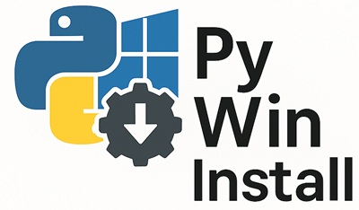

# PyWinInstall - Python Environment Installer



A Windows WPF application that automates the installation of Python, cloning of Git repositories, and setting up Python virtual environments with package installation.

## Features

- **Python Installation**: Downloads and installs specified Python versions from python.org
- **Git Repository Cloning**: Clones repositories using LibGit2Sharp
- **Virtual Environment Setup**: Creates Python virtual environments automatically
- **Package Installation**: Installs packages from requirements.txt or common packages
- **Desktop Shortcuts**: Creates desktop shortcuts for Python applications with custom icons
- **User-Friendly Interface**: Clean WPF interface with real-time progress tracking and output logging
- **Automated Workflow**: "Complete Setup" button for fully automated installation

## Requirements

- Windows 10/11
- .NET 8.0 SDK or later ([Download here](https://dotnet.microsoft.com/download/dotnet/8.0))
- Administrator privileges (for Python installation)
- Git (optional, for repository cloning functionality)

## Installation

### Prerequisites
1. **Install .NET 8.0 SDK**:
   - Visit https://dotnet.microsoft.com/download/dotnet/8.0
   - Download and install the SDK (not just the runtime)
   - Verify installation by running `dotnet --version` in a terminal

2. **Install Git** (optional):
   - Visit https://git-scm.com/download/win
   - Download and install Git for Windows

## Building the Application

1. Ensure you have .NET 8.0 SDK installed
2. Open terminal in project directory
3. Run: `dotnet restore`
4. Run: `dotnet build`
5. Run: `dotnet run` (or build and run the executable)

## Usage

### Individual Operations

1. **Install Python**:
   - Select desired Python version (3.9.19 to 3.12.6)
   - Choose installation directory
   - Click "Install Python"

2. **Clone Repository**:
2. **Clone Repository**:
   - Enter Git repository URL
   - Select destination directory
   - Click "Clone Repository"

3. **Setup Python Environment**:
   - Choose to create virtual environment
   - Select package installation options
   - Specify target Python program (e.g., astrofiler.py)
   - Enable desktop shortcut creation
   - Click "Setup Environment"

### Automated Installation

1. Configure Python installation, Git repository, and environment setup options
2. Click "Complete Setup" to run the entire process automatically

## Configuration Options

### Python Installation
- **Version**: Choose from supported Python versions (3.9.19 to 3.12.6)
- **Install Path**: Directory where Python will be installed (default: C:\Python)
- **Skip Installation**: Check if Python is already installed

### Git Repository
- **Repository URL**: Full Git repository URL (https or ssh)
- **Clone Path**: Directory where repository will be cloned

### Python Environment Setup
- **Create Virtual Environment**: Automatically creates .venv in the project directory
- **Install Packages**: Installs from requirements.txt or common packages (astropy, numpy, matplotlib, etc.)
- **Target Program**: Specify the main Python program to run (e.g., astrofiler.py)
- **Desktop Shortcut**: Creates a desktop shortcut that runs the target program without console windows

## Package Installation

The application can install packages in two ways:

1. **From requirements.txt**: If found in the cloned repository, packages are installed automatically
2. **Default packages**: If no requirements.txt is found, installs common packages:
   - astropy
   - peewee  
   - numpy
   - matplotlib
   - pytz
   - PySide6

All installations show real-time pip output with progress indicators.

## Desktop Shortcuts

The application creates desktop shortcuts that:
- Run the target Python program within the virtual environment
- Use application icons (.ico files) if found in the project
- Launch without showing console windows
- Set proper working directory

## Dependencies

- **LibGit2Sharp**: Git operations
- **System.Management.Automation**: PowerShell execution
- **System.Windows.Forms**: File/folder dialogs
- **Newtonsoft.Json**: JSON handling

## Security Considerations

- The application requires administrator privileges for Python installation
- Repository cloning uses default Git credentials

## Troubleshooting

### Python Installation Issues
- Ensure you have administrator privileges
- Check if antivirus is blocking the installer
- Verify internet connection for download

### Git Clone Issues
- Verify repository URL is accessible
- Check Git credentials for private repositories
- Ensure destination directory has write permissions

## Customization

### Adding New Python Versions
Edit the ComboBox items in `MainWindow.xaml`:
```xml
<ComboBoxItem Content="3.13.0"/>
```

### Modifying Download URLs
Update the `GetPythonDownloadUrl` method in `MainWindow.xaml.cs`

## License

This project is provided as-is for educational and development purposes.

## Contributing

Feel free to submit issues and enhancement requests!
